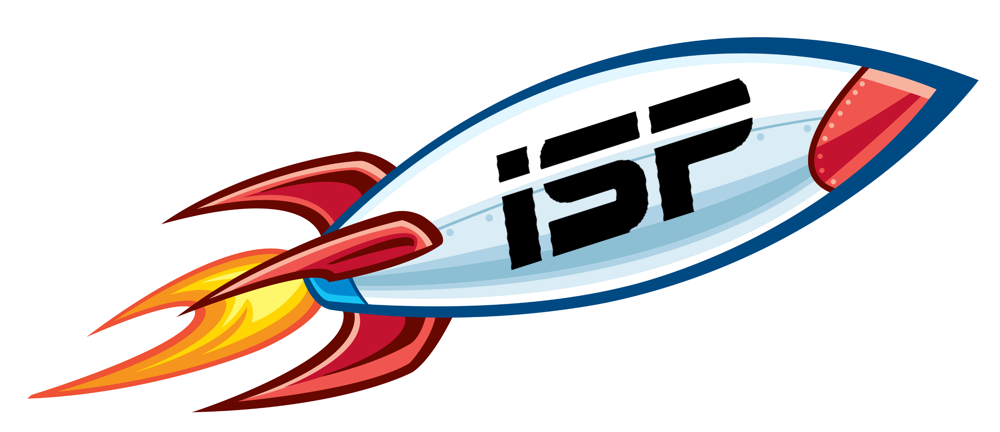
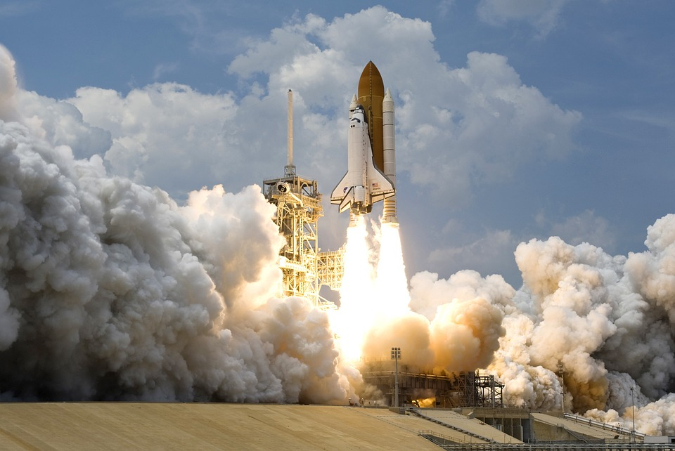
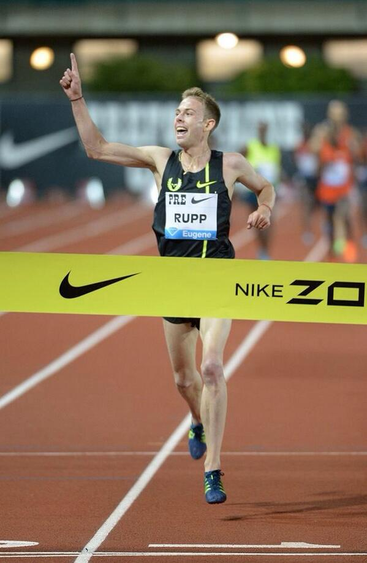
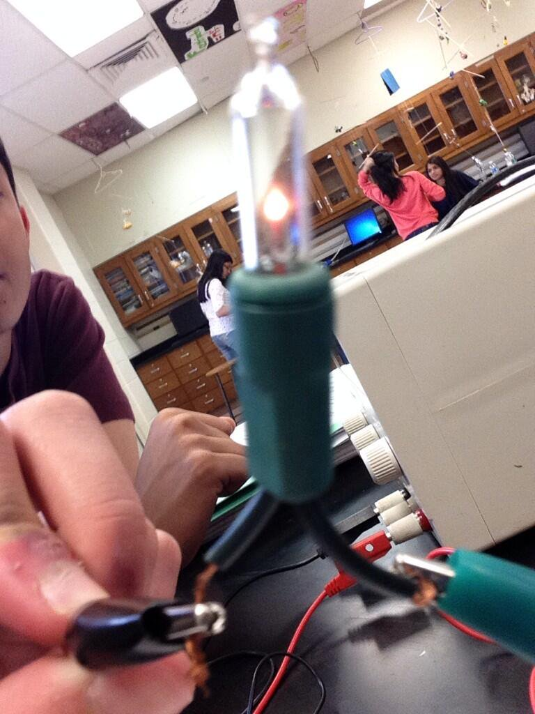

<!doctype html>

<html>

<title> ISP-Indian Space Program </title>

<!-- <h1 class="q">
<a style="color:white;" href="https://twitter.com/ISPMoonlife">Twitter</a>        
<a style="color:white;" href="https://www.facebook.com/ISPtothemoon/?fref=ts">Facebook</a>
<a style="color:white;" href="">Myspace</a>
</h1>

 
<ul>
  <li><a href="Home.html">Home</a></li>
  <li><a href="Our Mission.html">Our Mission</a></li>
  <li><a href="About Us.html">About Us</a></li>
  <li><a href="Contact.html">Contact</a></li> 
  <li><a  href="https://twitter.com/ISPMoonlife">Twitter</a> </li>       
  <li><a  href="https://www.facebook.com/ISPtothemoon/?fref=ts">Facebook</a></li>
</ul>
 

<body style="background-color:white">
<h2 style="color:orange;">Our latest events:</h2>

<h3>ISP launch testing!</h3>

Our first rocket lauch and it was a success! Over 69 people came to witness this small, but crutial step ISP took towards taking over Space X and NASA. 

<!--

Galen Rupp, the olympic medalist is representing ISP by performing the signature, index finger point position. This signature salute is known to bring good luck and fortune.

-->
</body>
</html>
